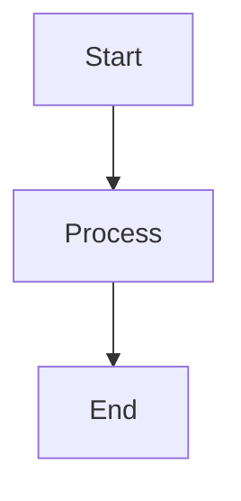

# Fumadocs Documentation Writing

## Audience

Content writers, technical writers, and developers creating documentation for websites built with Fumadocs framework.

## Goal

Produce well-structured, Fumadocs-compliant MDX documentation with proper frontmatter, markdown extensions, and interactive components.

## Fumadocs Basics

Fumadocs is a React.js documentation framework that uses MDX (Markdown + JSX) for content. It provides:
- Automatic navigation and table of contents
- Interactive components (Cards, Callouts, Tabs)
- Syntax highlighting with Shiki
- Framework-agnostic content handling

Official documentation: https://fumadocs.dev

## Frontmatter

Every Fumadocs MDX file requires YAML frontmatter with at minimum:

```yaml
---
title: Your Page Title
---
```

Common frontmatter fields:
- `title` (required): Page title displayed as h1
- `description`: Page description for SEO and previews
- `icon`: Icon for navigation items
- `full`: Boolean to disable aside navigation

Example:
```yaml
---
title: Getting Started
description: Learn how to set up your first Fumadocs project
icon: Rocket
full: false
---
```

Note: Don't use `# Heading 1` in content - the frontmatter `title` becomes h1.

## Content Structure

### Headings

Use heading hierarchy properly:
- Start with `##` (h2) as your top-level content heading
- Use `###`, `####` for subsections
- Anchors auto-generated from heading text

Customize heading behavior:
```md
## Overview [!toc]
Hidden from table of contents

## Quick Links [toc]
Only shown in TOC, not in content

## Installation [#custom-install-id]
Custom anchor for linking: /page#custom-install-id
```

### Links

Internal links use React framework's Link component for prefetching:
```md
[Internal Link](/docs/other-page)
```

External links get `rel="noreferrer noopener" target="_blank"`:
```md
[External Link](https://example.com)
https://example.com
```

## Markdown Extensions

### Code Blocks

Basic syntax highlighting:
````md
```js
console.log('Hello World');
```
````

With title:
````md
```js title="example.js"
console.log('Hello World');
```
````

Line numbers:
````md
```ts lineNumbers
const greeting = 'Hello';
console.log(greeting);
```
````

Highlight lines:
````md
```tsx
<div>Hello</div> // [!code highlight]
const old = 'remove'; // [!code --]
const new = 'add'; // [!code ++]
focus.on(this); // [!code focus]
```
````

Tab groups:
````md
```ts tab="TypeScript"
const msg: string = "Hello";
```

```js tab="JavaScript"
const msg = "Hello";
```
````

### Callouts

Alert boxes for tips, warnings, and important information:

```md
<Callout>
Default info callout
</Callout>

<Callout type="warn" title="Warning">
Caution needed here
</Callout>

<Callout type="error">
This is an error
</Callout>

<Callout type="success" title="Success">
Operation completed
</Callout>

<Callout type="idea">
Creative suggestion
</Callout>
```

### Cards

Display related links or content:

```md
<Cards>
<Card href="https://example.com" title="External Resource">
  Description of the resource
</Card>

<Card title="No Link Card">
  Card without href, for information only
</Card>

<Card icon={<HomeIcon />} href="/" title="With Icon">
  Cards support custom icons
</Card>
</Cards>
```

Auto-generate peer page cards:
```tsx
import { getPageTreePeers } from 'fumadocs-core/page-tree';
import { source } from '@/lib/source';

<Cards>
{getPageTreePeers(source.getPageTree(), '/docs/my-page').map((peer) => (
  <Card key={peer.url} title={peer.name} href={peer.url}>
    {peer.description}
  </Card>
))}
</Cards>
```

### Include Files

Reference external content (Fumadocs MDX only):
```md
<include>./shared-content.mdx</include>
```

### NPM Commands

Auto-generate package manager commands:
````md
```npm
npm i package-name -D
```
````

Renders tabs for npm, yarn, pnpm, bun.

## Additional Features

### Math Equations

LaTeX-style math (requires setup):
```md
Inline: $E = mc^2$

Block:
$$
\frac{-b \pm \sqrt{b^2 - 4ac}}{2a}
$$
```

### Mermaid Diagrams

Render diagrams (requires setup):
````md

````

### Twoslash

TypeScript hover information (requires setup):
````md
```ts twoslash
const greeting = "Hello World";
//    ^?
```
````

## Best Practices

1. **Start with frontmatter**: Always include `title` field
2. **Skip h1**: Don't use `# Heading` - use `##` as top level
3. **Descriptive headings**: Use clear, concise heading text
4. **Link appropriately**: Internal links for docs, external for outside resources
5. **Use callouts sparingly**: Only for truly important information
6. **Organize with cards**: Group related links and resources
7. **Show code clearly**: Use titles, line numbers, and highlighting
8. **Test navigation**: Verify page appears in correct location in sidebar

## File Organization

Fumadocs uses file-based routing:
- `content/docs/index.mdx` → `/docs`
- `content/docs/guide.mdx` → `/docs/guide`
- `content/docs/api/rest.mdx` → `/docs/api/rest`

Organize content in logical directory hierarchies matching desired URL structure.

## References

- [Fumadocs Documentation](https://fumadocs.dev/docs)
- [Fumadocs Markdown Guide](https://fumadocs.dev/docs/markdown)
- [Fumadocs Components](https://fumadocs.dev/docs/ui/components)
- [MDX Syntax](https://mdxjs.com/docs/what-is-mdx/)
- [Shiki Transformers](https://shiki.style/packages/transformers)
